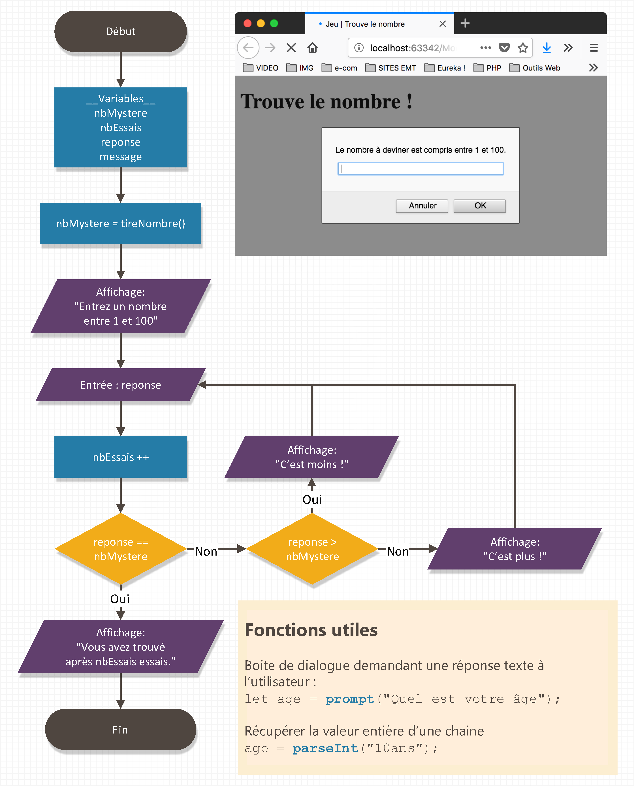

# Exercice "Jeu du nombre Mystère"

Votre objectif créer un petit jeu demandant au visiteur de deviner un nombre entre 1 et 100 🙇‍♀️.

Pour ce faire, récupérer le contenu du dossier `📁start` et modifier le code du fichier `js/devniner-nombre.js` tout en respectant l'algorithme ci-après.

Bonne chance 🍀

